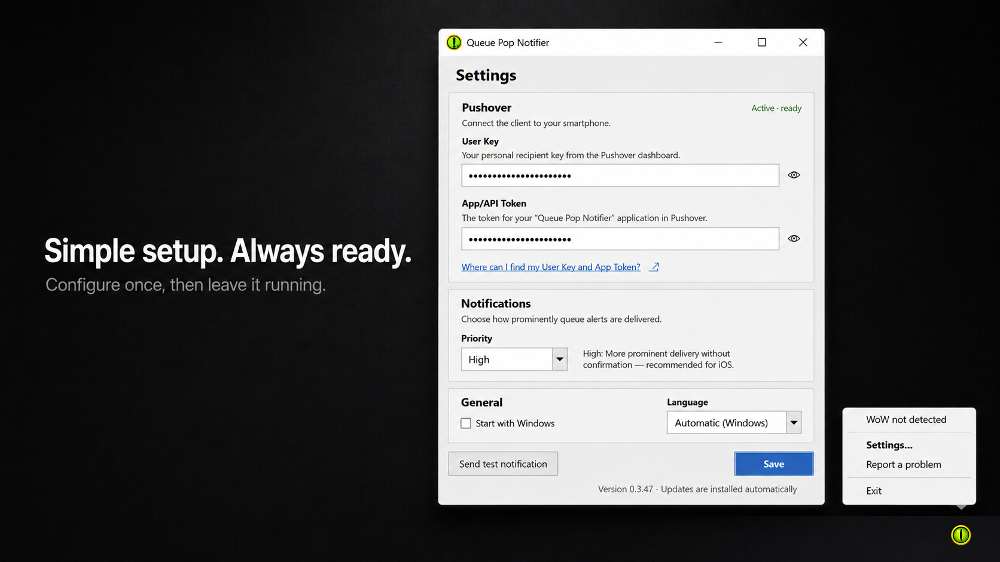
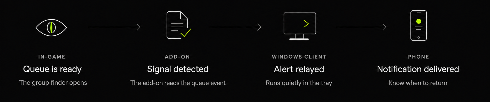

# Queue Pop Notifier

> **Never miss a World of Warcraft queue pop again.**

Queue Pop Notifier sends an instant notification to your smartphone when your World of Warcraft queue is ready — even if you are away from your computer.

The WoW add-on detects the queue pop and passes the event to the lightweight Windows desktop client. The client then sends the notification to your phone through [Pushover](https://pushover.net/).



## Features

* Instant smartphone notifications for World of Warcraft queue pops
* Automatic queue detection through the WoW add-on
* Lightweight Windows desktop client
* Runs quietly in the Windows system tray
* Automatic update checks when the client starts
* Optional automatic startup with Windows
* Built-in test notification
* Simple one-time Pushover setup
* Local storage of credentials and settings
* Reproducible Windows builds through GitHub Actions

## How It Works

1. Your World of Warcraft queue becomes ready.
2. The add-on detects the queue pop.
3. The desktop client receives the event.
4. Pushover sends an alert to your smartphone.



You can step away from your computer without constantly watching the screen.

## Requirements

* World of Warcraft Classic with the [Queue Pop Notifier add-on](https://www.curseforge.com/wow/addons/queue-pop-notifier) installed
* Windows 10 or Windows 11
* The Queue Pop Notifier desktop client
* A [Pushover](https://pushover.net/) account and smartphone app

## Desktop Client

The desktop client runs in the Windows system tray and remains unobtrusive during normal use. After the initial Pushover setup, no further interaction is normally required.

## Optional queue-pop sound

You can use the original queue-pop sound for notifications on your phone.

1. [Download the Queue Pop sound](queue_popup.mp3).
2. Open your [Pushover dashboard](https://pushover.net/sounds/build).
3. Under **Your Custom Sounds**, click **Upload a Sound**.
4. Select the downloaded sound file and give it a short name, such as **Queue**.
5. After uploading, select **Queue** as the notification sound in your Pushover app.

Your phone will now play the queue-pop sound whenever a queue is ready.

## Privacy and Local Storage

All Pushover credentials and application settings are stored locally under:

```text
%APPDATA%\QueuePopNotifier
```

Personal data and credentials are never included in the repository or distributed build artifacts.
