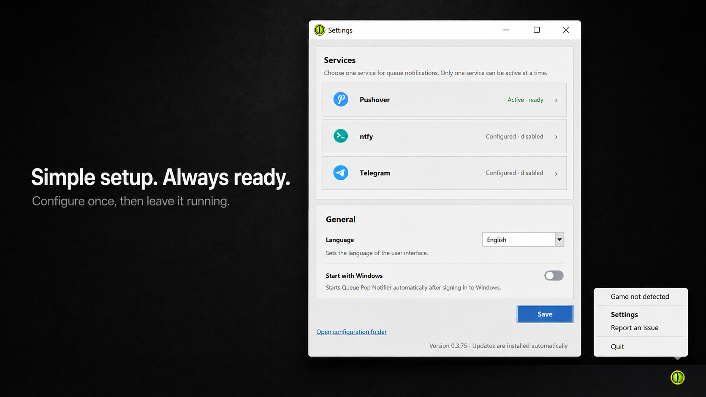
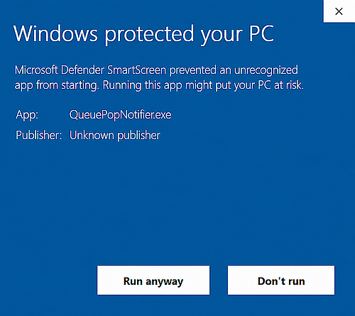

# Queue Pop Notifier

[](#requirements)
[](https://www.curseforge.com/wow/addons/queue-pop-notifier)


> **Never miss a World of Warcraft queue pop again.**

Queue Pop Notifier sends an instant notification to your smartphone when your World of Warcraft queue is ready, even if you are away from your computer.

The WoW add-on detects the queue pop and passes the event to the lightweight Windows desktop client. The client then sends the notification through your selected service: **Pushover, ntfy, or Telegram**.



## Features

- Instant smartphone notifications for World of Warcraft queue pops
- Support for **Pushover, ntfy, and Telegram**
- Automatic queue detection through the WoW add-on
- Lightweight Windows desktop client
- Runs quietly in the Windows system tray
- Automatic client updates
- Optional automatic startup with Windows
- Built-in connection test for each notification service
- Local storage of credentials and settings

## How It Works

1. Your World of Warcraft queue becomes ready.
2. The add-on detects the queue pop.
3. The desktop client receives the event.
4. Pushover sends an alert to your smartphone.


You can step away from your computer without constantly watching the screen.

## Requirements

- World of Warcraft Classic with the [Queue Pop Notifier add-on](https://www.curseforge.com/wow/addons/queue-pop-notifier) installed
- Windows 10 or Windows 11
- The Queue Pop Notifier desktop client
- At least one supported notification service:
  - [Pushover](https://pushover.net/)
  - [ntfy](https://ntfy.sh/)
  - [Telegram](https://telegram.org/)

## Desktop Client

The desktop client runs in the Windows system tray and remains unobtrusive during normal use. After the initial Pushover setup, no further interaction is normally required.

## Windows SmartScreen notice

The Windows companion client is currently **not digitally signed**. Because of this, Microsoft Defender SmartScreen may display a warning such as:

> **Windows protected your PC**  
> Microsoft Defender SmartScreen prevented an unrecognized app from starting. Running this app might put your PC at risk.

This warning does **not automatically mean that the application is malicious**. Windows shows it because the executable does not currently have a trusted code-signing certificate and has not yet built enough reputation with Microsoft SmartScreen.

Code-signing certificates involve additional cost and administrative requirements, which are difficult to justify for a small free open-source project.

If you downloaded Queue Pop Notifier from the official GitHub repository, you can compare the provided SHA-256 checksum with the downloaded executable before running it.



## Optional queue-pop sound

You can use the original queue-pop sound for notifications on your phone.

1. [Download the Queue Pop sound](queue_popup.mp3).
2. Open your [Pushover dashboard](https://pushover.net).
3. Under **Your Custom Sounds**, click **Upload a Sound**.
4. Select the downloaded sound file and give it a short name, such as **Queue**.
5. After uploading, select **Queue** as the notification sound in your Pushover app.

Your phone will now play the queue-pop sound whenever a queue is ready.

## Privacy and Local Storage

All Pushover credentials and application settings are stored locally under:

```text
%APPDATA%\QueuePopNotifier
```

Personal data and credentials are never included in the repository or distributed build artifacts.
